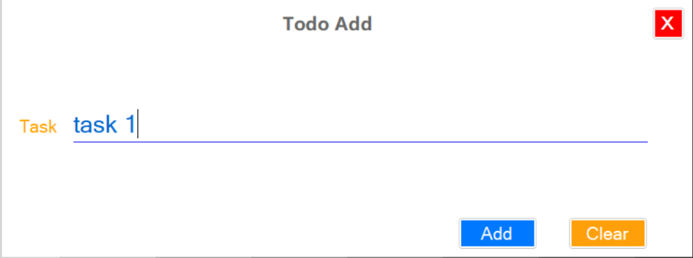
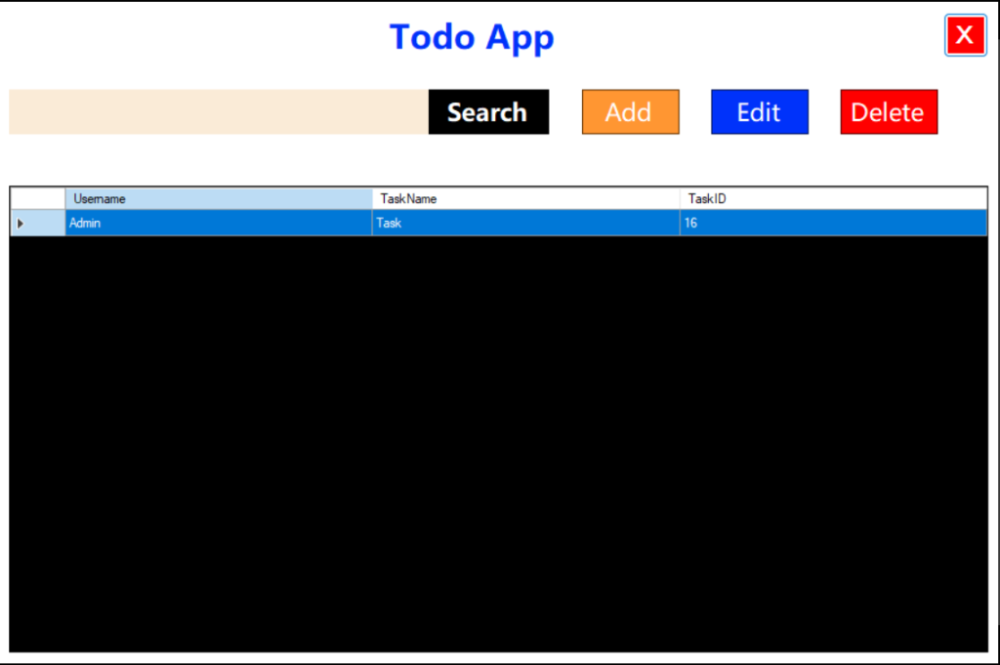
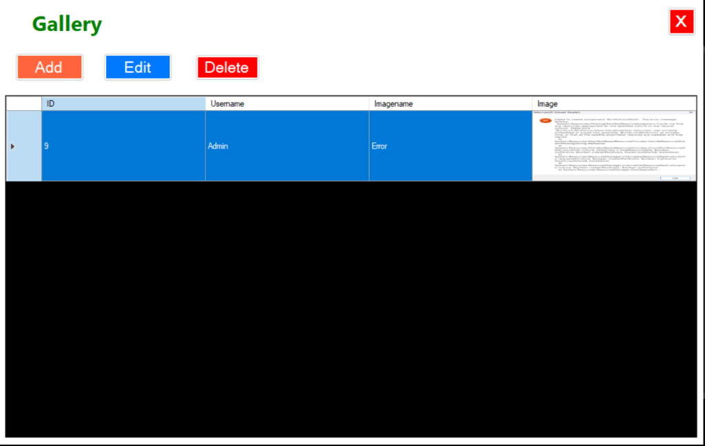
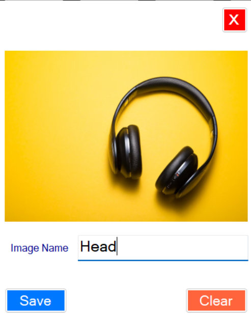
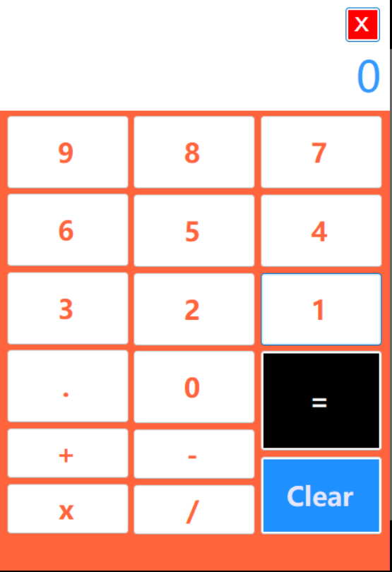

# 🌟 MyDay Hub - Personal Productivity Dashboard

[](https://dotnet.microsoft.com/)
[](https://learn.microsoft.com/en-us/dotnet/csharp/)
[](https://www.microsoft.com/sql-server)
[](https://github.com/PTharanan/MyDay-Hub-APPLICATION/releases/tag/v1.0.0)

**MyDay Hub** is a lightweight, responsive desktop productivity suite built using C# and Windows Forms (WinForms). Designed as an all-in-one daily dashboard, it integrates user authentication, task tracking (To-Do), a photo gallery, a built-in calculator, and smart real-time greeting personalization.

---

## 🚀 Key Features

*   🔐 **Secure User Authentication**: Complete Register, Login, and User Account edit flows backed by Microsoft SQL Server.
*   📋 **Interactive To-Do List**: Create, view, search, edit, and delete daily tasks.
*   🖼️ **Personal Image Gallery**: Store, view, edit, and delete image files directly within a database-driven gallery.
*   🧮 **Built-in Calculator**: A handy floating calculator panel for fast calculations.
*   🌤️ **Dynamic Greetings**: Greeting titles change automatically based on the time of day (Morning, Afternoon, Evening, Night).
*   🔑 **Admin Dashboard**: Manage user credentials and accounts from a single dashboard.

---

## 📂 Project Directory Structure

```text
MyDay-Hub-APPLICATION/
│
├── Project.sln                  # Visual Studio Solution file
│
└── Project/                     # Main C# WinForms Project directory
    │
    ├── Program.cs               # Main Entry Point of the application (Loads Login screen)
    ├── App.config               # Database config and application metadata
    ├── Project.csproj           # C# Project dependencies and compilation settings
    │
    ├── Contorller/              # Database controller layers
    │   ├── Login_DB.cs          # Authentication and user account SQL operations
    │   ├── Todo_DB.cs           # Task management SQL operations
    │   └── Gallery_DB.cs        # Gallery and image blob SQL operations
    │
    ├── Resources/               # Static assets, icons, and UI button images
    │
    └── Forms & UI Components:   # Windows Forms (UI Layout + Code-Behind)
        ├── Login.cs             # Login Form interface
        ├── Register .cs         # User Registration Form
        ├── App.cs               # Main Workspace Dashboard with Greetings
        ├── Admindashboard.cs    # Management panel for administrators
        ├── EditLoginData.cs     # Allows users to edit credentials
        ├── Todo.cs              # Core To-Do workspace list panel
        ├── TodoAddData.cs       # Task adding interface
        ├── TodoEditData.cs      # Task editing interface
        ├── Gallery.cs           # User's image gallery list
        ├── AddGallery.cs        # Screen to upload and save images
        ├── EditGallery.cs       # Screen to rename or update images
        └── Calcutor.cs          # Floating calculator tool
```

---

## 🛠️ Installation & Setup

To run MyDay Hub locally on your development machine, follow the steps below:

### 1. Prerequisites
*   **Operating System**: Windows 10/11
*   **IDE**: [Visual Studio 2019/2022](https://visualstudio.microsoft.com/) with *.NET Desktop Development* workload installed.
*   **Database**: **Microsoft SQL Server Express** (LocalDB or SQLEXPRESS instance).

### 2. Database Configuration
1.  Open **SQL Server Management Studio (SSMS)** or your preferred SQL Server explorer.
2.  Create a database named `Project`.
3.  Execute the following SQL queries to initialize the required tables:

```sql
-- Create Users Table
CREATE TABLE Users (
    Username NVARCHAR(50) PRIMARY KEY,
    Password NVARCHAR(255) NOT NULL
);

-- Create Tasks Table
CREATE TABLE Tasks (
    TaskID INT IDENTITY(1,1) PRIMARY KEY,
    Username NVARCHAR(50) FOREIGN KEY REFERENCES Users(Username) ON DELETE CASCADE,
    TaskName NVARCHAR(MAX) NOT NULL
);

-- Create Gallery / Image Table
CREATE TABLE Image (
    ID INT IDENTITY(1,1) PRIMARY KEY,
    Username NVARCHAR(50) FOREIGN KEY REFERENCES Users(Username) ON DELETE CASCADE,
    Imagename NVARCHAR(150),
    Image VARBINARY(MAX) NOT NULL
);
```

4.  If your SQL Server Express instance name differs from `ASD\SQLEXPRESS`, update the connection string inside the constructor of the DB controller classes:
    *   [Login_DB.cs](file:///d:/C%23lern/Project/Project/Contorller/Login_DB.cs#L19)
    *   [Todo_DB.cs](file:///d:/C%23lern/Project/Project/Contorller/Todo_DB.cs#L17)
    *   [Gallery_DB.cs](file:///d:/C%23lern/Project/Project/Contorller/Gallery_DB.cs#L19)

### 3. Build & Run
1.  Clone the repository:
    ```bash
    git clone https://github.com/PTharanan/MyDay-Hub-APPLICATION.git
    ```
2.  Open `Project.sln` inside Visual Studio.
3.  Restore NuGet packages if prompted.
4.  Set the solution configuration to `Debug` or `Release` and click **Start / Run**.

---

## 📦 How to Use the App (No Install Setup)

If you just want to run the application without building it from source:
1.  Go to the [Releases](https://github.com/PTharanan/MyDay-Hub-APPLICATION/releases/tag/v1.0.0) section of this repository.
2.  Download the **`MyDay-Hub-v1.0.0`** zip folder.
3.  Extract the ZIP and run the `Project.exe` application executable.
    *   *Note: You must have SQL Server Express installed locally with the configuration specified in the Database Configuration section for the app to save your data.*

---

## 🖼️ Application Walkthrough & Screenshots

### 📋 To-Do & Task Management
Stay organized by tracking your daily goals easily. The integrated to-do manager supports real-time search, task creation, editing, and single-click deletion.

| Add New Task | Tasks List Dashboard |
| :---: | :---: |
|  <br> *Adding new tasks* |  <br> *Interactive workspace displaying pending tasks* |

---

### 🖼️ Photo & Media Gallery
Store and view your digital files directly inside the program database. You can save custom titles along with your images.

| View Gallery | Save Image to Gallery |
| :---: | :---: |
|  <br> *Your visual gallery archive* |  <br> *Add or upload new pictures with names* |

---

### 🧮 Built-in Calculator
Need a quick math calculation while working? Open the floating utility calculator straight from the dashboard menu.

<p align="center">
  
  <br>
  <i>Simple utility calculator for rapid math</i>
</p>

---

## 🛡️ License
Distributed under the MIT License. See `LICENSE` for more information.
